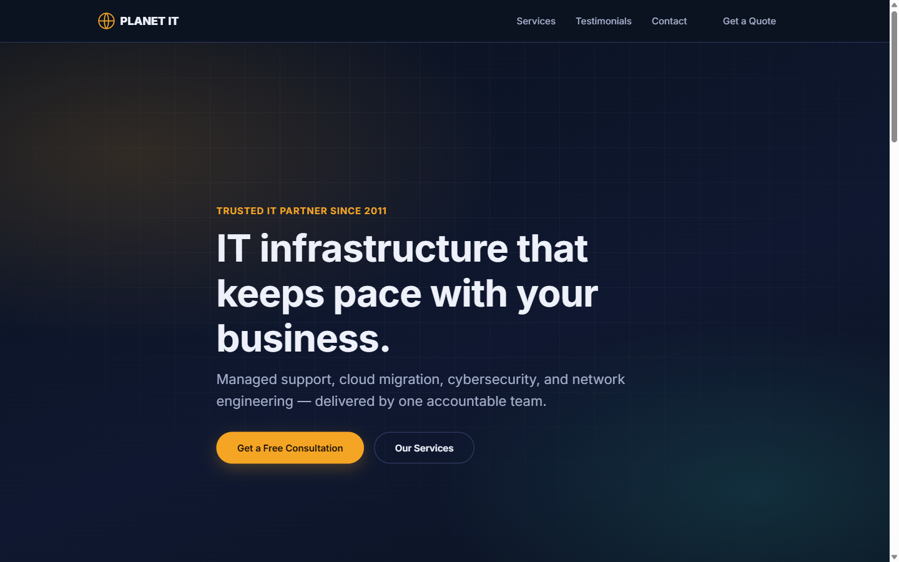

# PLANET IT

A responsive marketing landing page for a managed IT support, cloud, and cybersecurity services company.




## About

PLANET IT is a single-page site for a fictional managed IT services provider. It's built with plain HTML, CSS, and vanilla JavaScript — no framework, no bundler, no dependencies. The page covers:

- **Hero** section with call-to-action buttons
- **Services** grid (managed support, cloud migration, cybersecurity, network infrastructure)
- **Testimonials** carousel (swipeable on mobile, static grid on desktop)
- **Enquiry form** with client-side validation, a honeypot field for spam, and async submission via `fetch`
- Accessibility touches throughout: skip link, visible focus states, `prefers-reduced-motion` support, ARIA labeling

## Installation

No dependencies, no build tooling. Just clone the repo:

```bash
git clone https://github.com/thisisrey116/workflow.git
cd workflow
```

## Usage

Open [index.html](index.html) directly in a browser, or serve the folder locally:

```bash
npx serve .
```

To wire up the enquiry form to a real backend, replace the placeholder endpoint in [script.js](script.js):

```js
const FORM_ENDPOINT = 'https://example.com/api/enquiries';
```

## GitHub Pages

🔗 Live demo: https://thisisrey116.github.io/workflow/

## Credits

Built by [thisisrey116](https://github.com/thisisrey116).
